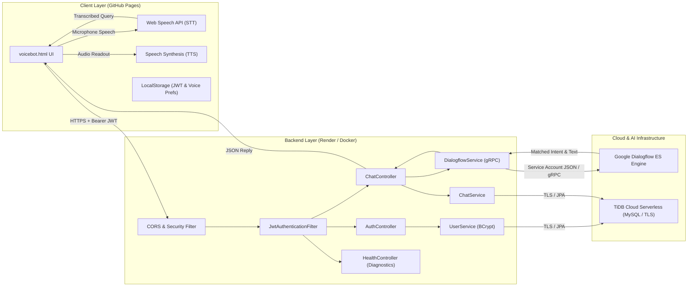
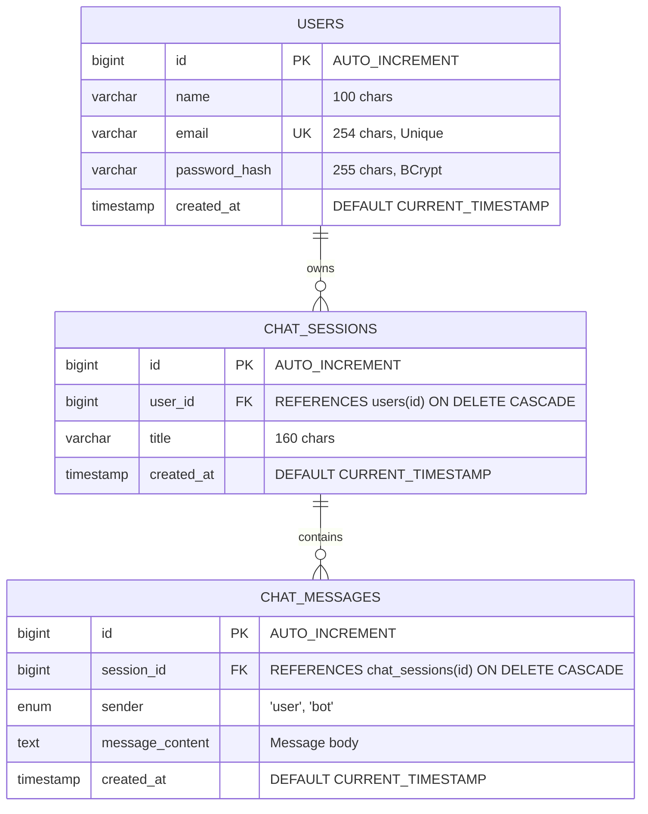

# 🐝 DBee — AI Voice & Vision Study Companion

<p align="center">
  
  
  
  
  
  
  
  
</p>

<p align="center">
  <b>An enterprise-grade, cloud-deployed conversational AI voice companion designed to help students master Database Management Systems (DBMS) through natural voice and text interactions.</b>
</p>

<p align="center">
  🌐 <b>Live Application:</b> <a href="https://hemakeshg.github.io/DBee-AI-Voice-and-Vision/voicebot.html">https://hemakeshg.github.io/DBee-AI-Voice-and-Vision/voicebot.html</a><br/>
  ⚙️ <b>Live Backend API:</b> <a href="https://dbee-backend.onrender.com">https://dbee-backend.onrender.com</a><br/>
  🩺 <b>System Diagnostics:</b> <a href="https://dbee-backend.onrender.com/health">https://dbee-backend.onrender.com/health</a>
</p>

---

## 🏆 Project Achievement

- 🥇 **1st Prize Winner** at **Drestin'25**
- 🎯 **Event Track:** **AI Voice and Vision**
- 💡 **Recognized For:** Seamless voice integration, NLP-driven interactive DBMS pedagogy, and robust full-stack architecture.

---

## 📌 Executive Summary

Modern computer science education often lacks interactive, real-time query support when studying complex concepts like Database Normalization, Relational Algebra, Transaction Concurrency, or ACID properties.

**DBee** addresses this challenge by functioning as a 24/7 personal interactive study tutor. Built on a cloud-native architecture, DBee combines real-time browser speech recognition, natural-sounding voice synthesis, Google Dialogflow natural language processing (NLP), an enterprise Java 21 / Spring Boot 3 backend, and a high-availability TiDB Cloud Serverless database.

---

## 🌟 Key Features & Functional Flow

### 1. 🎙️ Dual Voice & Text Conversational Interface
- **Continuous Speech-to-Text (STT):** Integrates the Web Speech API (`SpeechRecognition`) with Indian English (`en-IN`) acoustic models for real-time microphone dictation.
- **Audio Feedback (TTS):** Speaks answers using the browser's native `SpeechSynthesis` voice engine. Users can toggle voice replies on or off with preferences saved per account.
- **Micro-Interaction UI:** Includes visual microphone state feedback, real-time typing indicators, and auto-scrolling chat streams.

### 2. 🤖 AI-Powered DBMS Domain Intelligence
- Powered by **Google Cloud Dialogflow ES** trained on DBMS taxonomies:
  - Relational Models & ER Diagrams
  - Normalization (1NF, 2NF, 3NF, BCNF)
  - SQL Queries (DDL, DML, DCL, TCL, Aggregations, Joins)
  - Indexing, B-Trees, and Hashing
  - Transactions, Isolation Levels, and ACID compliance
  - Concurrency Control (2PL, Deadlocks, Timestamping)
- Context-aware intent detection provides conceptual explanations and query examples.

### 3. 💬 Persistent Multi-Session History
- Users can create, switch between, and manage multiple isolated chat sessions.
- All conversations, individual user prompts, and AI responses are automatically timestamped and permanently persisted in the cloud database.
- Features one-click chat history clearing with confirmation safeguards.

### 4. 🔒 User Authentication & Account Security
- **Dual-mode Authentication:** Seamlessly supports both `Authorization: Bearer <token>` and `HttpOnly; SameSite=None; Secure` cookies to prevent modern cross-site third-party cookie restrictions.
- **BCrypt Password Hashing:** User passwords are encrypted using BCrypt with strength factor 12 before database persistence.
- **In-App Profile Management:** Allows users to view their registration date, update their profile name/email, and securely change passwords.

---

## 🏗️ System Architecture & Workflow



---

## 🛠️ Technical Stack Breakdown

| Layer | Technologies Used | Description |
| :--- | :--- | :--- |
| **Frontend** | Vanilla HTML5, CSS3, JavaScript (ES6+) | Single-Page Application (SPA) designed with glassmorphic tokens, CSS variables, and zero heavy framework overhead |
| **Speech APIs** | Web Speech API (`SpeechRecognition`, `SpeechSynthesis`) | Browser-native audio capture and voice output calibrated to `en-IN` |
| **Backend Framework** | Java 21 (LTS), Spring Boot 3.4.5 | Modern Spring ecosystem utilizing Java Records, Virtual Threads capability, and Spring MVC |
| **Security Layer** | Spring Security 6, JJWT (io.jsonwebtoken 0.12.6) | Stateless token-based architecture with BCrypt hashing and CORS origin pattern matching |
| **Persistence / ORM** | Spring Data JPA, Hibernate, MySQL Connector/J | Object-relational mapping, automatic connection pooling via HikariCP |
| **Cloud Database** | TiDB Cloud Serverless (MySQL 8.0 Protocol) | Fully managed, highly available distributed SQL database with mandatory TLS/SSL encryption |
| **NLP Engine** | Google Cloud Dialogflow ES (`google-cloud-dialogflow 4.74.0`) | Intent classification, entity recognition, and pedagogical responses via Google Cloud SDK |
| **Containerization** | Docker (Multi-stage build) | Multi-stage image: `maven:3.9.9-eclipse-temurin-21` (build) $\rightarrow$ `eclipse-temurin:21-jre` (runtime) |
| **Hosting & CI/CD** | Render (Web Service), GitHub Pages | Automated container builds on Git pushes and globally distributed static frontend delivery |

---

## 🗄️ Database Schema & Relational Design

The database schema is defined in [`schema.sql`](./schema.sql) and implemented in MySQL / TiDB Cloud:



### Schema Highlights:
- **Referential Integrity:** Enforces `ON DELETE CASCADE` so deleting a user or chat session cleanly removes associated history without orphaned rows.
- **Index Optimization:** 
  - Composite index `idx_chat_sessions_user_created (user_id, created_at)` accelerates chronological session listing.
  - Composite index `idx_chat_messages_session_created (session_id, created_at)` enables rapid chat message retrieval.

---

## 🔒 Security & Authentication Architecture

1. **Dual Token Delivery (Bearer + Cookie):**
   - When a user logs in or registers, the server generates a cryptographically signed HMAC-SHA256 JWT.
   - The token is returned in the response JSON payload **and** set as an `HttpOnly; SameSite=None; Secure` cookie.
   - The frontend stores the token in `localStorage` and transmits it via `Authorization: Bearer <token>`, guaranteeing seamless cross-site communication between GitHub Pages (`https://hemakeshg.github.io`) and Render (`https://dbee-backend.onrender.com`) without being blocked by modern browser third-party cookie restrictions.
2. **CORS Hardening:**
   - Spring Security explicitly allows origin patterns matching `https://*.github.io` and local development hosts.
   - Supports preflight `OPTIONS` caching (`maxAge: 3600s`) and credentialed requests (`allowCredentials: true`).
3. **Secret Isolation:**
   - Google Cloud Service Account credentials are kept strictly out of git repositories.
   - Render mounts credentials through encrypted **Secret Files** at `/etc/secrets/dialogflow-key.json`.

---

## 📡 REST API Reference

### 1. Authentication Endpoints (`/api/auth`)
| Method | Endpoint | Auth Required | Description |
| :--- | :--- | :---: | :--- |
| `POST` | `/api/auth/register` | No | Registers a new user, hashes password, returns user & JWT |
| `POST` | `/api/auth/login` | No | Validates credentials, returns user profile & JWT |
| `POST` | `/api/auth/logout` | No | Clears user session cookie |
| `GET` | `/api/auth/me` | **Yes** | Returns authenticated user profile |
| `PATCH`| `/api/auth/profile` | **Yes** | Updates current user's name and email |
| `PATCH`| `/api/auth/password`| **Yes** | Updates user password after verifying current password |

### 2. Chat & NLP Endpoints (`/api/chat`)
| Method | Endpoint | Auth Required | Description |
| :--- | :--- | :---: | :--- |
| `GET` | `/api/chat/sessions` | **Yes** | Retrieves all chat sessions for the logged-in user |
| `POST`| `/api/chat/sessions` | **Yes** | Creates a new chat session |
| `DELETE`| `/api/chat/sessions` | **Yes** | Clears all chat sessions and messages for the user |
| `GET` | `/api/chat/sessions/{id}/messages` | **Yes** | Loads all messages within a specific session |
| `POST`| `/api/chat/sessions/{id}/messages` | **Yes** | Sends query to Dialogflow, logs both user & bot messages |

### 3. Monitoring & Diagnostics (`/health`)
| Method | Endpoint | Description |
| :--- | :--- | :--- |
| `GET` | `/health` | Live diagnostic probe verifying TiDB database connection, `users` table state, JWT secret length, and Dialogflow credentials file existence |

---

## 🚀 Running Locally

### Prerequisites
- Java Development Kit (JDK) 21 or higher
- Apache Maven 3.9+
- MySQL 8.0+ or a free TiDB Cloud account
- Google Cloud Dialogflow ES Service Account JSON key

### 1. Clone the Repository
```bash
git clone https://github.com/HEMAKESHG/DBee-AI-Voice-and-Vision.git
cd DBee-AI-Voice-and-Vision
```

### 2. Configure Environment Variables
Copy `.env.example` and set your database and Dialogflow credentials:

```powershell
# In PowerShell:
$env:PORT="3000"
$env:FRONTEND_ORIGIN="http://localhost:8000"
$env:DB_HOST="127.0.0.1"
$env:DB_PORT="3306"
$env:DB_NAME="dbee"
$env:DB_USER="root"
$env:DB_PASSWORD="your-local-password"
$env:DB_SSL="false"
$env:JWT_SECRET="your-32-character-secret-key-goes-here"
$env:DIALOGFLOW_PROJECT_ID="hemakesh-qiwp"
$env:DIALOGFLOW_LANGUAGE_CODE="en"
$env:GOOGLE_APPLICATION_CREDENTIALS="C:\path\to\service-account.json"
```

### 3. Initialize Database
Execute `schema.sql` against your MySQL database:
```bash
mysql -u root -p dbee < schema.sql
```

### 4. Build and Run the Backend
```bash
cd dbee-spring
mvn clean package -DskipTests
java -jar target/dbee-spring-1.0.0.jar
```
The backend will boot up at `http://localhost:3000`.

### 5. Launch the Frontend
Open `voicebot.html` using Python or any simple HTTP server:
```bash
# In the project root:
python -m http.server 8000
```
Visit `http://localhost:8000/voicebot.html` in Chrome or Edge.

---

## ☁️ Cloud Deployment Configuration

This project is deployed using a production cloud stack:

1. **Frontend (GitHub Pages):**
   - Hosted directly from the `main` branch root.
   - `index.html` provides automatic redirect to `voicebot.html`.
2. **Backend (Render Docker Web Service):**
   - Multi-stage Docker container builds the Spring Boot JAR with Temurin 21.
   - Service account credentials mounted safely via Render Secret Files (`/etc/secrets/dialogflow-key.json`).
3. **Database (TiDB Cloud Serverless):**
   - Elastic serverless MySQL with auto-scaling and TLS encryption (`DB_SSL=true`).

---

## 👨‍💻 Author

**Hemakesh G**  
🎓 *B.E. Computer Science & Engineering — Saveetha Engineering College*  
💼 Java Developer | Cloud Architect | AI Enthusiast  

- 🔗 **LinkedIn:** [linkedin.com/in/hemakesh-g-714745285](https://www.linkedin.com/in/hemakesh-g-714745285/)
- 🐙 **GitHub:** [github.com/HEMAKESHG](https://github.com/HEMAKESHG)

---

<p align="center">
  <b>Built with ❤️ for interactive education using Java, Spring Boot, Dialogflow, and Web Speech APIs.</b>
</p>
